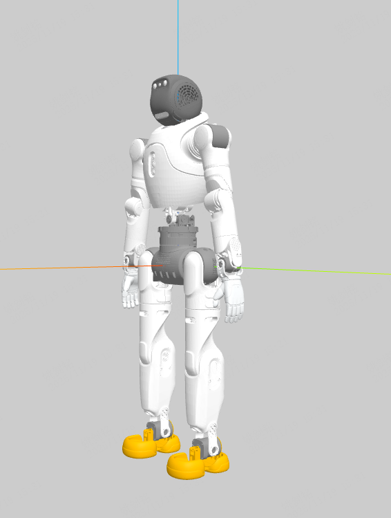
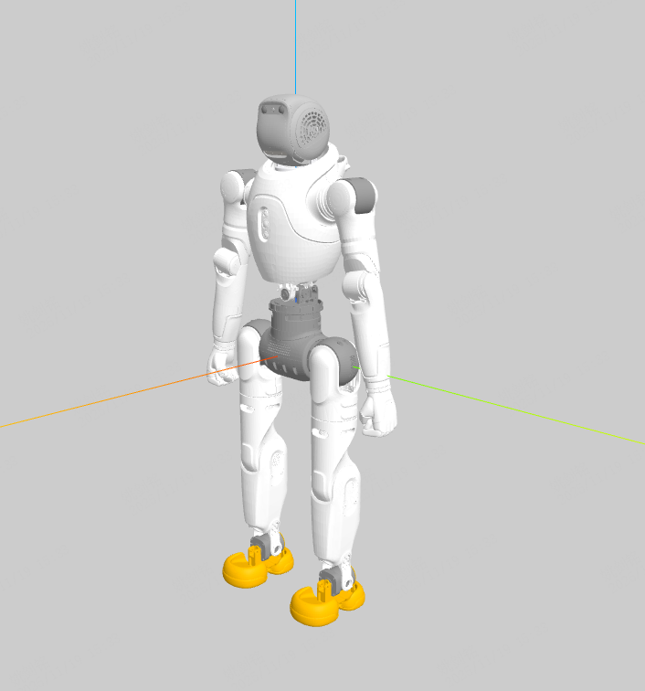

# X2 Ultra Robot Model

[中文文档](README_CN.md)

## Models

### x2_ultra



### x2_fist (dummy fist)



## Files

```
├── x2_ultra.urdf                   # Full model
├── x2_ultra_simple_collision.urdf  # Simplified collision
├── x2_ultra.xml                    # MuJoCo format
├── x2_fist.urdf                    # Dummy fist end-effector
├── x2_fist.xml                     # Dummy fist end-effector (MuJoCo)
├── scene.xml                       # Scene file
├── meshes/                         # Mesh files (STL)
└── visual/                         # Preview images
```

## License

This project is licensed under the Mulan PSL v2 (木兰宽松许可证, 第2版). See [LICENSE](../LICENSE) for details.
