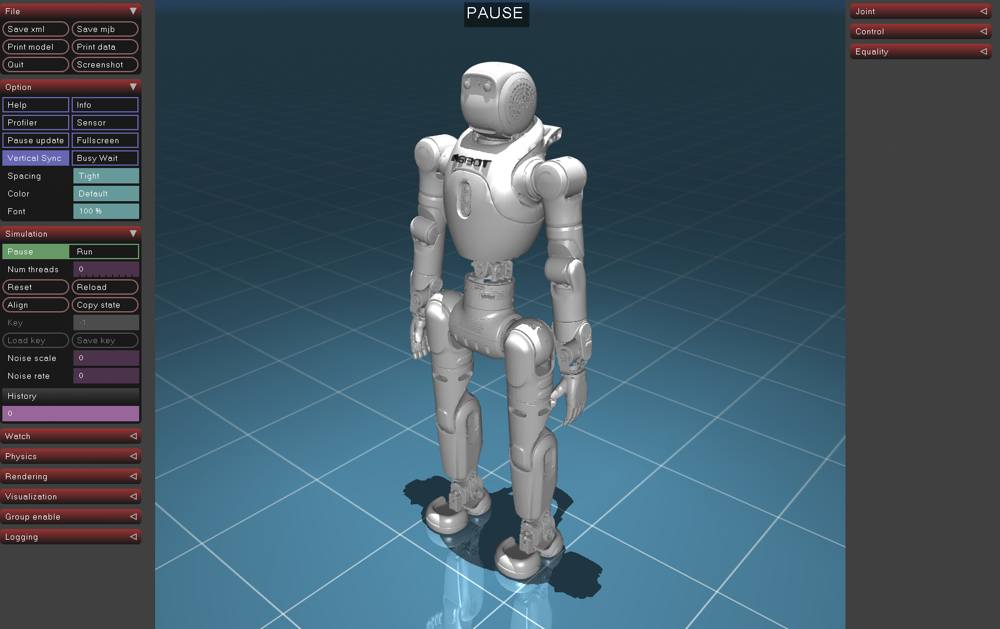

# X2 旗舰焕新版机器人模型

[English](README.md)

## 文件清单

```
├── scene.xml                       # 场景文件
├── X2-Ultra.urdf                   # X2 旗舰焕新版 — 完整模型
├── X2-Ultra_simple_collision.urdf  # X2 旗舰焕新版 — 简化碰撞体
├── X2-Ultra.xml                    # X2 旗舰焕新版 — MuJoCo 格式
├── meshes/                         # 网格模型（STL）
└── visual/                         # 预览图片
```

## 模型预览

### X2 旗舰焕新版



## 旗舰版 → 旗舰焕新版 版本变更说明

### 电机

* 峰值扭矩从 36 N·m 升级为 60 N·m。受影响关节：
  1. `*_ankle_pitch_joint`
  2. `*_shoulder_pitch_joint`
  3. `*_shoulder_roll_joint`

* 峰值扭矩从 24 N·m 升级为 36 N·m。受影响关节：
  1. `*_ankle_roll_joint`
  2. `*_shoulder_yaw_joint`
  3. `*_elbow_joint`
  4. `*_wrist_yaw_joint`
  5. `*_waist_pitch_joint`
  6. `*_waist_roll_joint`

* 腕部电机更换，峰值扭矩 6 N·m。受影响关节：
  1. `wrist_roll_joint`
  2. `wrist_pitch_joint`

### 整机

* X2-Ultra 质量：约 41 kg → 约 45 kg
* 结构件强度加强

## URDF 处理

URDF 处理工具位于 `X2_URDF-v1.3.0/scripts/` 目录。

## 许可证

本项目采用木兰宽松许可证，第2版（Mulan PSL v2）开源。详见 [LICENSE](../LICENSE) 文件。